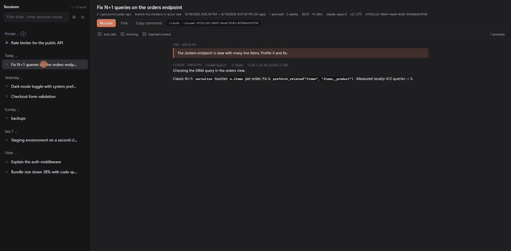

# Claude Sessions

Claude Sessions is a local sidebar for your Claude Code sessions, in the spirit of the desktop app: pinned sessions, groups, search across titles and message bodies, readable transcripts, and one-click resume in a terminal.

`/sessions` inside Claude Code opens it in your browser. It costs zero tokens: a `UserPromptSubmit` hook handles the command before the model sees it.



## Requirements

- Claude Code 2.1.265 or newer
- Python 3.8+ on `PATH` (`python3`, `python` or `py`) — standard library only
- Bash (Git Bash on Windows, which Claude Code already needs)

## Install

From this marketplace:

```
/plugin marketplace add junioorosa/claude-sessions
/plugin install sessions@claude-sessions
```

Or drop it in your skills directory (loads on the next session, no install step):

```
git clone https://github.com/junioorosa/claude-sessions ~/dev/claude-sessions
ln -s ~/dev/claude-sessions/plugins/sessions ~/.claude/skills/sessions
```

Pick one of the two. Installing both loads the hook twice.

For development: `claude --plugin-dir ./plugins/sessions`.

## Use

| Command | Effect |
|---|---|
| `/sessions` | start the viewer for the current config dir if needed, open the browser |
| `/sessions status` | is a viewer running for this config dir |
| `/sessions reindex` | rescan every session file |
| `/sessions stop` | shut the viewer down (it also exits by itself after 30 idle minutes) |

In the page: click a session to read it, double-click (or **Resume**) to open `claude --resume <id>` in a new terminal tab, drag rows into **Pinned** or a group, right-click for rename/hide/copy. Enter in the search box searches message bodies.

## How it works

- Sessions are read from `<config dir>/projects/*/<uuid>.jsonl`; the config dir is `CLAUDE_CONFIG_DIR` or `~/.claude`, so each account sees only its own sessions and gets its own server and port.
- Nothing leaves the machine: the server binds `127.0.0.1` only.
- Index cache, pins/groups and the server file live in `<config dir>/plugins/data/sessions/`.
- The transcript view follows the active branch of the session (rewinds and forks are left out, compaction boundaries are marked).
- The page updates by itself: the server checks file timestamps every 1.5s and pushes changes over server-sent events, so a running session grows on screen as Claude answers. A 30s poll remains as fallback.

## Uninstall

`/plugin uninstall sessions@claude-sessions`, or remove the symlink from `~/.claude/skills/`. Delete `<config dir>/plugins/data/sessions/` to drop the cache and the pin/group state.
